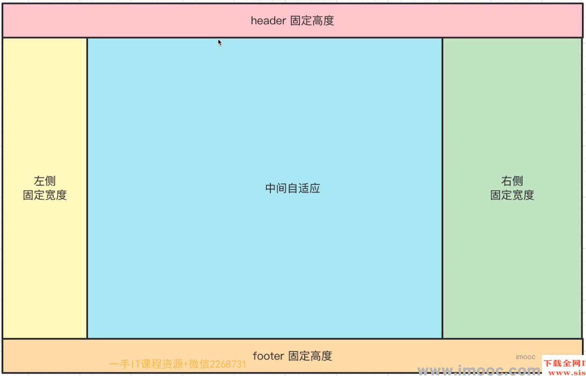

## 1. 1px 问题

背景

- 其实就是在问, 如果要实现 0.5px 的方法, 主要问题是 在不同浏览器上, 小于 1px 的会默认为 1px
- css 1px 是逻辑像素, 而屏幕是逻辑像素, 设备像素比 dpr 不同, 逻辑像素最终转换为物理像素就不同
- 设备像素比 = 物理设备像素 / 逻辑像素

兼容性问题

1. chrome：把小于 0.5px 的当成 0，大于等于 0.5px 的当作 1px

2. firefox：会把大于等于 0.55px 的当作 1px

3. safiri:把大于等于 0.75px 的当作 1px 进一步在手机上观察 iOS 的 Chrome 会画出 0.5px 的边，而安卓(5.0)原生浏览器是不行的。所以直接设置 0.5px 不同浏览器的差异比较大

**实现方式**

box-shadow 模拟边框

```css
.div {
  box-shadow: inset 0px -1px 1px -1px #c8c7cc;
}
```

伪元素 + transform

```css
.scale-1px {
  position: relative;
  border: none;
}

.scale-1px:after {
  content: "";
  position: absolute;
  bottom: 0;
  background: #000;
  width: 100%;
  height: 1px;
  /*核心是利用transform缩放边框*/
  -webkit-transform: scaleY(0.5);
  transform: scaleY(0.5);
  -webkit-transform-origin: 0 0;
  transform-origin: 0 0;
}
```

这个实现方式, 可以通过 js 获取设备像素比, 来判断要用什么缩放比例

```javascript
if (window.devicePixelRatio && devicePixelRatio >= 2) {
  document.querySelector("ul").className = "scale-1px";
}
```

## 2. CSS 操作题 总结

操作题主要包括: 选择器优先级、定位 (布局)、盒子模型

布局问题 (实现下面图片的样式)



```html
<!DOCTYPE html>
<html lang="en">
  <head>
    <meta charset="UTF-8" />
    <meta http-equiv="X-UA-Compatible" content="IE=edge" />
    <meta name="viewport" content="width=device-width, initial-scale=1.0" />
    <title>Document</title>
  </head>
  <style>
    * {
      padding: 0;
      margin: 0;
    }
    body {
      display: flex;
      flex-direction: column;
      height: 100vh;
    }
    .header {
      width: 100%;
      height: 100px;
      background: red;
    }
    .middle-box {
      flex: 1;
      display: flex;
    }
    .box-left {
      width: 50px;
      background: yellow;
    }
    .box-middle {
      flex: 1;
      background: blue;
    }
    .box-right {
      width: 50px;
      background: green;
    }
    .footer {
      width: 100%;
      height: 50px;
      background: orange;
    }
  </style>
  <body>
    <header class="header">header 固定高度</header>
    <section class="middle-box">
      <aside class="box-left">左侧固定宽度度</aside>
      <section class="box-middle">中间自适应</section>
      <aside class="box-right">右侧固定宽度</aside>
    </section>
    <footer class="footer">footer 固定高度</footer>
  </body>
</html>
```

要点

- CSS flex 布局要熟练
- 标签语义化, 但是面试可以这样写, 工作中大多没必要, div + css 即可, 需要 SEO 再用语义化标签

## 3. CSS 高级语法的应用

主题切换

- 使用 css var

```css
html {
  --color: #333;
}
html .black {
  --color: #fff;
}
p {
  color: var(--color);
}
```

计算属性

- calc

```css
.main {
  min-height: clac(100vh - 80px);
}
```
