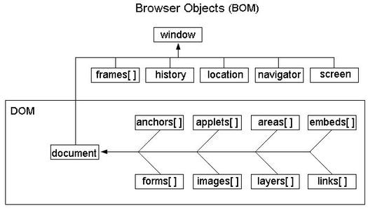

### 1. Map、Set、Object Array 的区别

Map 与 Object

- Map 有序结构, key 任意类型; Object 无序结构, key 两种类型 (String、Symbol)
- Set 可以自动去重
- Map 和 Set 比 Object Array 整体要执行更快

[Map、Set 相关语法](https://juejin.cn/post/7064479924757168165)

## 2. 闭包

以下代码输出什么？

```javascript
for (var i = 0; i < 10; i++) {
  setTimeout(() => {
    console.log(i);
  });
}
//  输出 10 个 10
```

将上面代码修改下, 输出结果为 0 ~ 9

```javascript
// 方法一 闭包
for (var i = 0; i < 10; i++) {
  (function (i) {
    setTimeout(() => {
      console.log(i);
    });
  })(i);
}
```

```javascript
for (let i = 0; i < 10; i++) {
  setTimeout(() => {
    console.log(i);
  });
}
```

扩展: let 有块作用域, var 没有块作用域

## 3. JS 基本知识

闭包、原型链、异步、深浅拷贝、Promise、变量提升

## 4. 截取 数组最快的办法

通过直接设置, 数组长度即可

```javascript
let arr = [1, 2, 6, 8];
arr.length = 2;
console.log(arr); // [1, 2]
```

## 5. DOM 和 BOM 的区别？

DOM 与 BOM 的模型



区别

DOM 文档对象模型

BOM 浏览器对象模型

## 6. 普通事件绑定和事件流绑定有啥区别（中级）

普通事件绑定

- 如果给同⼀个元素绑定了两次或者多次相同类型的事件，那么后⾯的绑定会覆盖前⾯的绑定
- 利用`on`开头的的事件`onclick`
- 不支持`dom`事件流（捕获-目标-冒泡）

```javascript
// 传统方法 绑定事件 用onclick
var buts = document.querySelectorAll("button");
buts[0].onclick = function () {
  alert("new day");
};
```

事件流绑定

- 如果说给同⼀个元素绑定了两次或者多次相同类型的事件，所有的绑定将会依次触发
- 支持`dom`事件流（捕获-目标-冒泡）
- 不加`on`事件

```javascript
// addEventListener 事件监听的方法 绑定事件
// 监听事件一
buts[1].addEventListener("click", function () {
  alert("last day");
  // 传统解绑事件
  buts.onclick = null;
});
// 监听事件二
function fn() {
  alert("next day");
  // 用 API 方式解绑事件
  buts[1].removeEeventListener("click", fn);
}
buts[1].addEventListener("click", fn);
```

## 7. 如何阻止事件冒泡和默认事件（中级）

阻止事件冒泡: `e.preventdefault()`

阻止默认事件: `e.stoppropagation()`

## 8. document.onload 和 document.ready、window.onload（初级）

区别

- Document.onload 是在结构和样式加载完才执⾏ js

- window.onload：不仅仅要在结构和样式加载完，还要执⾏完所有的样式、图片这些资源文件，全部 加载完才会触发`window.onload`事件

- Document.ready 原⽣种没有这个⽅法，`jquery` 中有`$().ready(function)`

## 9. undefined 的三种情况（初级）

变量、对象、数组 只定义了, 未赋值

- ⼀个变量定义了却没有被赋值
- ⼀个对象上不存在的属性或者⽅法
- ⼀个数组中没有被赋值的元素

## 10. 对象模型 BOM 里常用的至少 4 个对象（初级）

- Window
- document
- location (获取路由的主机名、端口等信息)
- screen (显示屏幕的信息, 浏览器浏览器最大时的宽高等信息)
- history (获取路由信息, url)
- navigator (获取浏览器信息, 通常用于判断浏览器名称)

## 11. JavaScript 存储对象是哪两个 (初级)

`window.localStorage` 在浏览器中存储 key/value 对, 没有过期时间

`window.sessionStorage` 在浏览器中存储 key/value 对, 没有过期时间

## 12. 会造成内存泄漏的情况（中级）

- `setTimeout`的第⼀个参数使⽤字符串⽽非函数的话，会引发内存泄漏。
- 闭包

```javascript
// setTimeout 的错误使用
setTimeout("666", 100);
// setTimeout 的正确用法
setTimeout(() => {
  console.log("666");
}, 1000);
```

```javascript
// 闭包的简单实现
```

## 13. 闭包中变量如何释放

```javascript
let fn = function () {
  let sum = 0;
  return function () {
    sum++;
    console.log(sum);
  };
};
fn1 = fn();
fn1(); //1
fn1(); //2
fn1(); //3
fn1 = null; // fn1的引用fn被手动释放了
fn1 = fn(); //num再次归零
fn1(); //1
```
