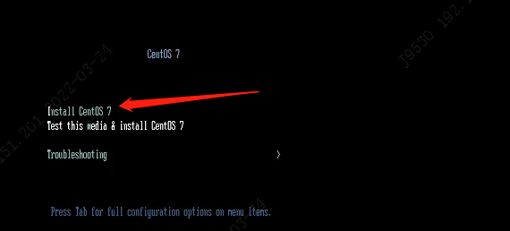
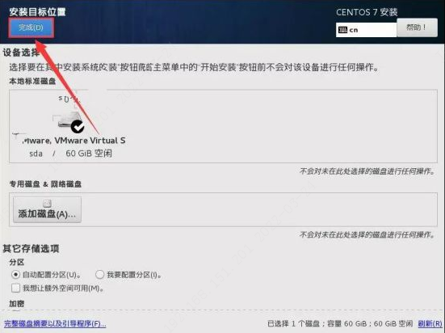

# CentOS 7 真机安装实测

## 1. 环境准备

**工具准备** `(预先行其事，必先利其器)`。

下载 `Rufus` 、 `CentOS 镜像` 制作启动 U 盘

[阿里云开源镜像](https://mirrors.aliyun.com/centos/7.9.2009/isos/x86_64/)

[Rufus - 启动U盘](http://rufus.ie/zh/)

**Rufus 启动盘制作流程**

- 选择 U 盘
- 选择 镜像
- 点击 开始
- 等到状态，到准备就绪后，点击关闭即可 `不要再点开始，不然会重新制作一遍，贼坑`

## 2. 安装开始

1. 将 U 盘插入电脑，并重启。电脑刚亮，连续按 `Ctrl + F12` 直到出现 `bios` 界面，并选择从 U 盘启动。

不同电脑可能界面不一样，但是你只要选择 这个 `USB` 开头的就一定对的

`需要注意每个电脑进去 bios 界面的方式是不一样的，我的电脑是 Lenovo。`

2. 选择第一个回车即可

3. 语言的话，选择中文吧，比较好点，等下配置其他的时候，也是中文界面会比较简单点。如果你英语能力比较强的话，也可以选择英语。`下面界面选择了英语`

   

   

   

4. 其他配置

   - 时间选择：亚洲 上海

   - 语言就选择，中文 `当然可以选择多个，英语和中文`

   - 键盘就选择，中文 `同样可以选择多个`

   - 分区选择默认就可以了 `当然你要自定义随意`

     

     

     

   - 网络的话，也很简单，选择 有线或无线都行，等下安装完了，再设置也行

     

     

   - 选择软件的话，选择 `gnome` 桌面

     

   

   

5. 接下来的配置，就是配置密码什么的，直接下一步，下一步就可以了，最后安装完成，重启即可

   

   

   

6. 重启后，同意协议

   

   

   

   

7. 语言、键盘都选择汉语

8. 其他能跳过，就跳过，再设置下密码什么的就可以了

   

   
## 3. 快捷键

   - 图形 到 dos （dos 到 图形）：`ctrl+alt+f2`

