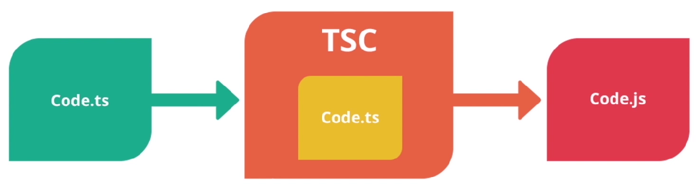
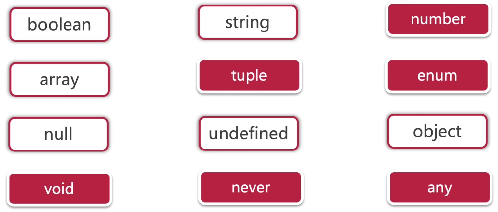
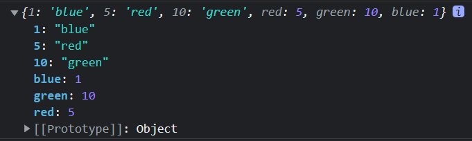

## 1. TypeScript 与 JavaScript 有什么区别？

- 规范代码
- 代码编译阶段就能及时发现错误, 说是编译, 其实就将 TypeScript 转换为 JavaScript
- 在原生 js 的基础上加上了一层类型定义
- 兼容性强, 兼容 js 的所有语法, 还包括更新版本的 ES6、ES7、ES8

## 2 TypeScript 工作流



扩展: ES6 编译器 Babel ( ES6 转 ES5 )

## 3. TypeScript 执行、编译

插件

```shell
npm install -g typescript
```

查看版本

```shell
tsc -v
```

编译

```shell
tsc main.ts
```

使用了 get set 懒人包以后, 编译版本必须是 ES5 或以上

```shell
tsc -t es5 main.ts
```

## 4. TypeScript 基本语法

#### 变量声明

TypeScript 应尽量避免使用 `var`, 而应该去使用 `const`、`let`

#### 类型



#### 高级类型

- union 组合类型
- Nullable 可空类型
- Literal 预定义类型

#### 简单声明变量类型 (数字、布尔、字符)

```typescript
// 变量
let name: string = "Lin";
let isMan: boolean = true;
// 函数
function add(num1: number, num2: number) {
  return num1 + num2;
}
```

#### 数组 (Array) 和 元组 (Tupple)

数组

```typescript
let list1: number[] = [1, 2, 3, 4]; // 标准写法, 创建元素都为数字类型的数组
let list2: Array<number> = [1, 2, 3, 4]; // 用泛型来定义数组中每个元素的类型
let list3 = [1, 2, 3, 4]; // 不写类型直接定义也行
let list4: any[] = [1, "dss", true]; // 可以存放任意类型元素的数组
```

元组 (读音: 踏 bou)

- 元组是特殊的数组, 固定长度、固定类型的数组
- 元组有些许 bug (可以使用 push(), 增加数组长度)

```typescript
let person1: [number, string] = [1, "Lin"];
let person2 = [1, "Lin"]; // 混合类型的数组, 可以增加长度, 修改类型
```

#### 联合类型(Union) 与 字面量类型(Literal)

联合类型

```typescript
let union: string | number; // 联合类型, 这样的声明, 只能赋值 string、number, 赋值其他类型会报错
// 函数参数联合类型声明
function merage(n1: number | string, n2: number | string) {
  if (typeof n1 === "string" || typeof n2 === "string")
    return n1.toString() + n2.toString();
  else return n1 + n2;
}

let mergeNumber = merge(2, 5);
let mergeString = merge("hello", "world");
```

字面量类型

- 可以限制, 类型的范围

```typescript
let literal: 0 | 1 | 2; // literal 定义为数字类型, 且只有赋值为 0、1、2
let literal2: 1 | "2" | true | [1, 2, 3, 4]; // literal2 限定只能是 1、“2”、true、[1, 2, 3, 4]

// 函数参数联合类型声明、与字面量类型混合使用
// 第三个参数只能是填 as-number 或 as-string
function merage(
  n1: number | string,
  n2: number | string,
  resultType: "as-number" | "as-string"
) {
  if (resultType === "as-string") return n1.toString() + n2.toString();
  if (typeof n1 === "string" || typeof n2 === "string")
    return n1.toString() + n2.toString();
  else return n1 + n2;
}

let mergeNumber = merge(2, 5, "as-number");
let mergeNumber = merge(2, 5, "as-string");
```

#### 枚举类型(Enum)

- 枚举类型真正的数据类型是数字 (与 C++ 类似, 从 0 开始计算)

```typescript
// 枚举类型定义
enum Color {
  red,
  green,
  blue,
}
// 枚举类型使用
let color = Color.blue;
console.log(color); // 2
```

```typescript
// 可以自定义枚举类型顺序
enum Color2 {
  red = 5,
  green = 10,
  blue = 1,
}
console.log(Color2);
```



```typescript
// 枚举类型的元素也可以定义为其他类型
enum Color3 {
  red = "red",
  green = "green",
  blue = 1,
}
let color3 = Color3.green;
console.log(color3); // green
```

#### 动态类型 any 类型 和 unknow 类型

any 类型

- 可以实现快速开发, 不用考虑各种约定俗成的类型定义
- 不太容易维护、阅读

```typescript
let randomValue: any = 666;
randomValue = true;
randomValue = "Lin";
randomValue = {};
randomValue();
randomValue.toUpperCase();
```

unknow 类型

- 不保证类型, 但是保证类型安全
- 确定变量类型以后, 才可以使用

```typescript
let randomValue: unknow = 666;
randomValue = true;
randomValue = "Lin";
randomValue = {};
if (typeof randomValue === "function") {
  randomValue();
}
if (typeof randomValue === "string") {
  randomValue.toUpperCase();
}
```

使用场景

- 项目需要快速开发、紧急上线 可以使用 any
- 要保证安全可以选择 unknow

#### void、undefined、never

void 可以不用回调

```typescript
// 没有任何返回的函数就是 void 类型
// 原生 javascript 没有 void 类型
function printResult(): void {
  console.log("Lin");
}
```

undefined 一定要回调

```typescript
// javascript 中有 undefind 这个类型
function printResult(): undefined {
  console.log("Lin");
  return;
}
```

never 一个函数永远执行不完, 没法执行完成

- throw 抛出异常、while 循环 都可以让函数无法执行结束
- never 通常用来处理异常, 处理 promise

```typescript
function throwError(message: string, errorCode: number): never {
  throw {
    message,
    errorCode,
  };
}
throwError("not found", 404);
```

```typescript
function whileLoop(): never {
  while (true) {
    console.log("haha");
  }
}
```

哲学层面

undefined 表示物质不存在

void 表示存在本身就不存在

代码层面

undefined 指变量未赋值, 未初始化

void 指变量本身就不存在

日常: 能偷懒就偷懒, 实在不知道什么类型就写 any

#### 类型适配(类型断言) Type Assertions

写代码时得十分明确变量的类型, 才可以使用类型断言, 不然会引起严重的错误

```typescript
let message: any;
message = "abc";
message.endsWith("c"); // 无法使用, 得使用类型断言, 明确为 string类型, 才可以使用 string 相关的函数
// 两种类型断言
let abc = (<string>message).endsWidth("c");
let abcd = (message as string).endsWidth("c");
```

扩展

`endsWith()` 方法用来判断当前字符串是否是以另外一个给定的子字符串“结尾”

根据判断结果返回 `true` 或 `false`

#### 函数类型 (函数参数类型的声明)

**可选参数**：可以通过, `?` 来表示参数的可选性, 如果没有 `?` 就是必填参数

**默认参数**：可以与 javascript 一样的方式用 `=` 设置默认值

不顾是 **可选参数**、还是 **默认参数** 都只能末尾加

```typescript
// code 不填的话, 默认会输出 undefined
let log = (message: string, code?: number) => {
  console.log(message, code);
};
log("hello"); // hello undefined
```

```typescript
let log = (message: string, code: number = 0) => {
  console.log(message, code);
};
log("hello"); // hello 0
```

#### 对象 Object

```typescript
// object 这个类型定义可写可不写, 通常不用写, 因为意义不大
const person: object = {
  firstName: "Lin",
  lastName: "刘",
  age: 18,
};
console.log(person.nockname); // 访问未定义的对象属性会, 编译报错, 也编译器也会提示错误
```

#### Interface 与 Class

Interface (接口)

```typescript
// Point 接口限制了输入的参数类型
let drawPoint = (point: Point) => {
  console.log({ x: point.x, y: point.y });
};

drawPoint({ x: 105, y: 24 });
// drawPoint({ x: "Lin", y: "Jin" }) 会直接报错
// drawPoint({ wether: "干燥", temperature: "5oC" }) 会直接报错
// 定义了接口
interface Point {
  x: number;
  y: number;
}
```

Class 类

```typescript
interface IPoint {
  x: number;
  y: number;
  drawPoint: () => void;
  getDistances: (p: IPoint) => number;
}

// class 类项 implements 接口 {  }
class Point implements IPoint {
  // 声明成员变量
  x: number;
  y: number;

  // 构造函数, 可以初始化值, 绑定到 this 上
  // 加上 ? 后, new 的时候就可以不传参了
  // 使用 = , 设置默认值
  constructor(x?: number, y: number = 2) {
    this.x = x;
    this.y = y;
  }

  // 实现成员方法
  drawPoint = () => {
    // 点位置
    console.log("x: ", this.x, "y: ", this.y);
  };
  getDistances = (p: IPoint) => {
    // 两点之间平方和
    return Math.pow(p.x - this.x, 2) + Math.pow(p.y - this.y, 2);
  };
}

// 创建实例
const point = new Point(); // 对象Object, 也称 实例Instance
point.drawPoint();
```

扩展

JavaScript 的 构造函数 与其他语言的不同？

JavaScript 的 构造函数 不可以重载 overload, 也就是说一个类有且仅有一个 constructor

而我们给 构造函数 加上？, 或设置默认值, 就相当于变相重载构造函数了

#### Access Modifier 访问修饰符

- public 公有属性
- private 私有属性
- protected

```typescript
interface IPoint {
  drawPoint: () => void;
  getDistances: (p: IPoint) => number;
  X: number;
}

// class 类项 implements 接口 {  }
class Point implements IPoint {
  // 构造函数, 可以初始化值, 绑定到 this 上
  // 使用 public 等就不需要再重新 赋值给 this, typescript 会自动赋值的
  constructor(private _x_: number, private _y_: number = 2) {}

  // 实现成员方法
  drawPoint = () => {
    // 点位置
    console.log("x: ", this._x_, "y: ", this._y_);
  };
  getDistances = (p: IPoint) => {
    // 两点之间平方和
    return Math.pow(p.X - this._x_, 2) + Math.pow(p.Y - this._y_, 2);
  };
  // 设置内部数据
  set X(value: number) {
    if (value < 0) {
      throw new Error("value不能小于0");
    }
    this._x_ = value;
  }
  // 获取内部数据
  get X() {
    return this._x_;
  }
  get Y() {
    return this._y_;
  }
}

// 创建实例
const point = new Point(); // 对象Object, 也称 实例Instance
point.X = 10;
console.log(point.X); // 10
point.drawPoint();
```

扩展

public 不一定要写, 因为默认没写的话, 就是 public 公有属性

#### Generics 泛型

泛型可以保持类型的一致性

```typescript
// 使用泛型, 将类型传入
let lastInArray = <T>(arr: Array<T>) => {
    return arr[arr.length - 1]
}
// 也可以这么写
let lastInArray = <T>(arr: <T>[]) => {
    return arr[arr.length - 1]
}

const l1 = lastInArray([1, 2, 3, 4])
const l2 = lastInArray(["a", "b", "c"])
const l3 = lastInArray<string>(["a", "b", "c"]) // 泛型可以定义输入输出的类型
const l4 = lastInArray<string | number>(["a", "b", "c"]) // 泛型可以定义输入输出的类型
```

多泛型类型

```typescript
// 常规
let makeTuple = <T, Y>(x: T, y: Y) => [x, y];
const v1 = makeTuple(1, "one");
const v2 = makeTuple<boolean, number>(true, 1); // 前面的 <boolean, number> 不写 ts 会动态匹配

// 设置默认值
let makeTuple = <T, Y = number>(x: T, y: Y) => [x, y]; // 可以设置默认类型
const v2 = makeTuple<boolean>(true, 1); // 可以省略第二个泛型的定义
```

## 5. Module 模块基本使用

```typescript
// point.ts
interface IPoint {
  drawPoint: () => void;
  getDistances: (p: IPoint) => number;
  X: number;
  Y: number;
}

// class 类项 implements 接口 {  }
export class Point implements IPoint {
  // 构造函数, 可以初始化值, 绑定到 this 上
  // 使用 public 等就不需要再重新 赋值给 this, typescript 会自动赋值的
  constructor(private _x_: number, private _y_: number) {}

  // 实现成员方法
  drawPoint = () => {
    // 点位置
    console.log("x: ", this._x_, "y: ", this._y_);
  };
  getDistances = (p: IPoint) => {
    // 两点之间平方和
    return Math.pow(p.X - this._x_, 2) + Math.pow(p.Y - this._y_, 2);
  };
  // 设置内部数据
  set X(value: number) {
    if (value < 0) {
      throw new Error("value不能小于0");
    }
    this._x_ = value;
  }
  // 获取内部数据
  get X() {
    return this._x_;
  }
  get Y() {
    return this._y_;
  }
}
```

```typescript
// main.js
import { Point } from "./point";
const point = new Point(24, 50); // 对象Object, 也称 实例Instance
point.X = 10;
console.log(point.X); // 10
point.drawPoint();
```
