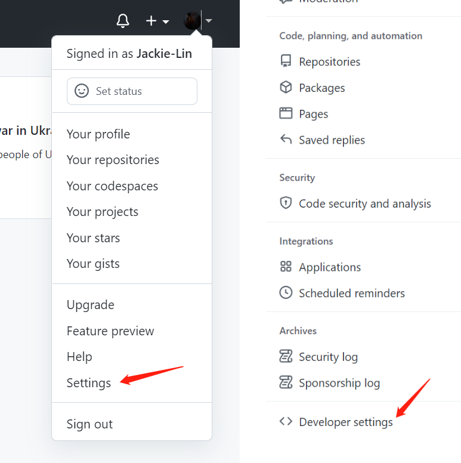
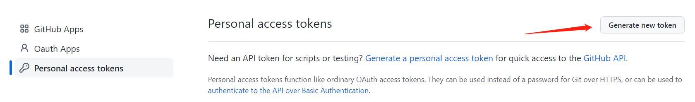
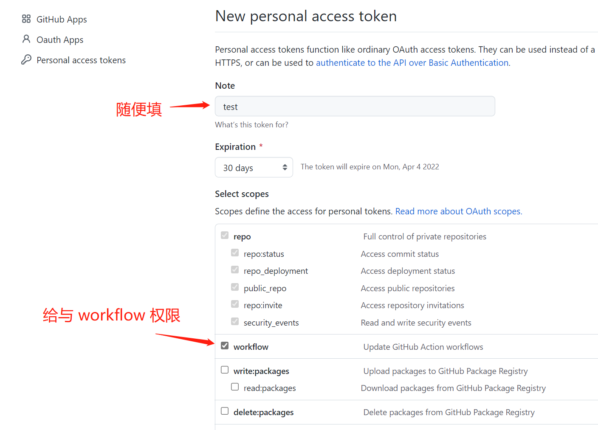
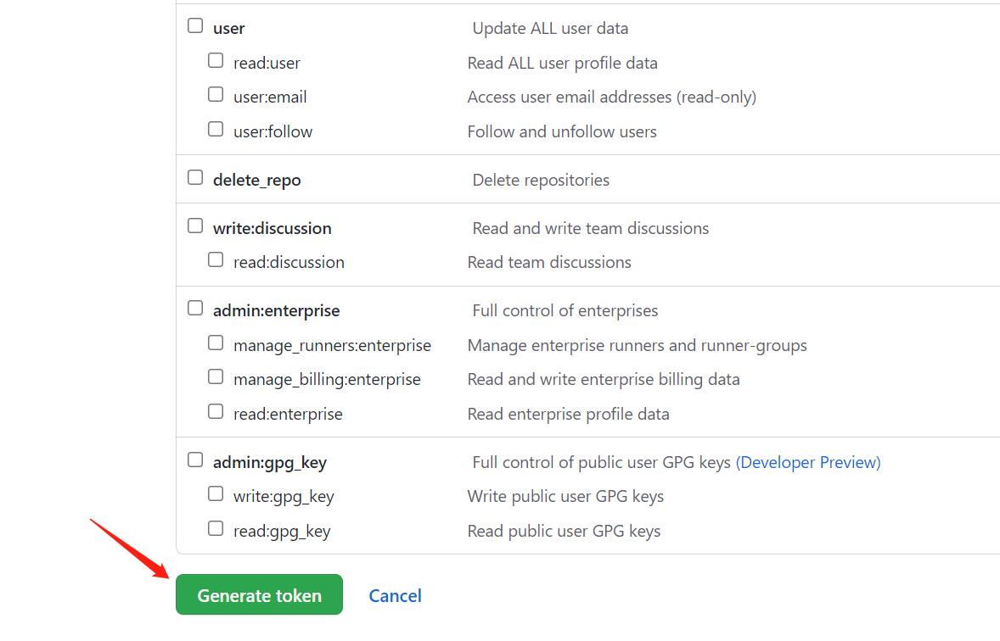
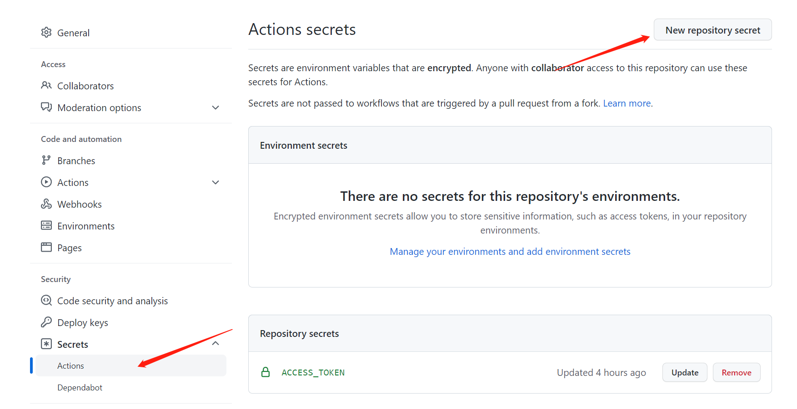
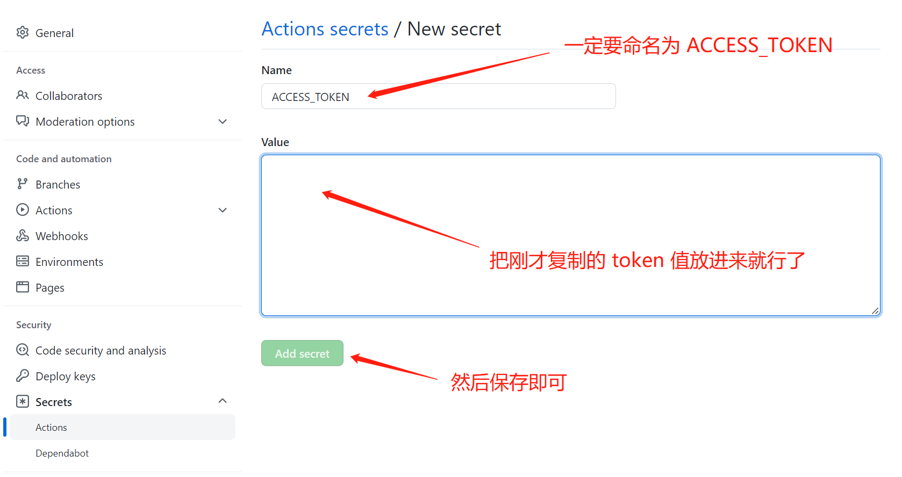
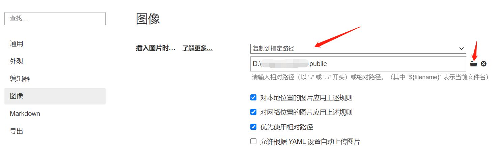

# github actions 使用

## 配置 vuePres

待写

## 配置 workflow 执行文件

首先需要在你的项目下新建 `.github/workflows/` 文件夹，接着在 `workflows` 文件夹下新增 `xxx.yml` 文件，这个文件名随意，但是必须是 `yaml` 文件，比如我新增文件名为 `master.yml`，


并在 `master.yml` 输入以下配置内容

```yaml
name: Build and Deploy
on:
  push:
    branches:
      - master # 表示当我们向 master 分支 push 时就会触发该 workflow
jobs:
  build-and-deploy: # jobs：规定要执行的任务，例如上面我们定义了一个任务 build-and-deploy
    runs-on: ubuntu-latest # 运行所需要的虚拟机环境 
    steps:
      - name: Checkout 🛎️ # 拉取主分支的代码
        uses: actions/checkout@v2.3.1

      - name: Install and Build 🔧 # 运行两个命令 npm install 与 npm run docs:build
        run: |
          npm install
          npm run docs:build
        env:
          NODE_OPTIONS: '--max_old_space_size=4096'

      - name: Deploy 🚀 # 将生成的静态文件夹部署到 gh-pages 分支上
        uses: JamesIves/github-pages-deploy-action@4.1.3
        with:
          BRANCH: gh-pages
          FOLDER: docs/.vuepress/dist
          ACCESS_TOKEN: ${{ secrets.ACCESS_TOKEN }}
```

这个 `.yml` 主要就是用来告诉 `workflow` 如何去运行我们的程序

主要分三个部分：**触发条件、运行环境、操作执行**

1. **触发条件**

   ```yaml
   on:
     push:
       branches:
         - master 
   ```

   表示当我们向 `master` 分支 `push` 时就会触发该 `workflow`
   
   


2. **运行环境**
   
   ```yaml
    jobs:
    	build-and-deploy: 
    	runs-on: ubuntu-latest 
   ```
   
   `jobs` 规定要执行的任务，例如上面我们定义了一个任务 `build-and-deploy`
   
   `runs-on` 表示运行所需要的虚拟机环境
   
   github 为我们提供了如下环境
   
   - `ubuntu-latest`、`ubuntu-18.04` 或 `ubuntu-16.04`
   - `windows-latest`、`windows-2019` 或 `windows-2016`
   - `macOS-latest` 或 `macOS-10.14`
   
   这里我选择 `ubuntu-latest`
   
   
   
3. **操作执行**

   其实就是依次执行三个操作：

   - 拉取分支代码
   - 运行 `npm install` 与 `npm run docs:build`
   - 将生成的静态文件夹部署到 `gh-pages` 分支上

   ```yaml
   steps:
       - name: Checkout 🛎️ # 拉取主分支的代码
         uses: actions/checkout@v2.3.1
   
       - name: Install and Build 🔧 # 运行两个命令 npm install 与 npm run docs:build
         run: |
         	npm install
       	npm run docs:build
         env:
       	NODE_OPTIONS: '--max_old_space_size=4096' # 防止 超出内存
   
       - name: Deploy 🚀 # 将生成的静态文件夹部署到 gh-pages 分支上
         uses: JamesIves/github-pages-deploy-action@4.1.3
       	with:
           BRANCH: gh-pages 
           FOLDER: docs/.vuepress/dist # 打包后的文件路径
           ACCESS_TOKEN: ${{ secrets.ACCESS_TOKEN }} # github 的 access_token
   ```

   

## 配置 access_token

操作步骤比较简单，直接按图片步骤操作就行



 











## 配置静态资源

使用 Typora 写作的时候，我们经常会把图片复制粘贴到文章里面，在本地还好，一旦发布到 由 `vuePress` 创建 `github pages` 静态网站的时候，图片就会显示不出来。

为了解决这个问题，我们需要把图片弄到 `gitHub` 上，对此我们将通过配置使 Typora 可以复制粘贴图片后，自动保存在 vuePress 的静态资源文件夹中。

首先，我们在 `vuePress` 文件夹中创建一个 `public` 文件夹，来存放静态文件


然后，打开 Typora 的 **偏好设置**，设置为**复制到指定路径**，并配置指定路径。



自此，复制图片到 Typora 的时候，就会自动复制一份到 vuePress 的静态资源里面了，等 `push` 文章的时候，就会把资源也一起打包发布 gitHub 上。
